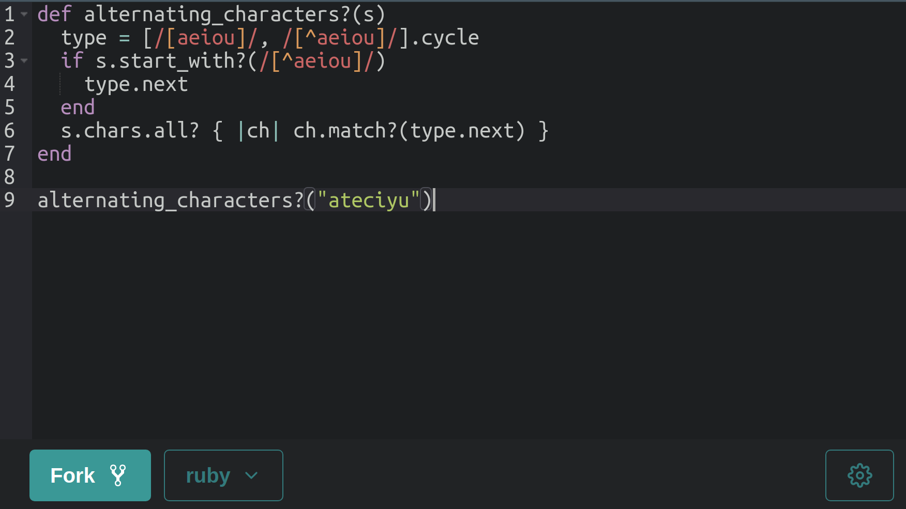

# Kod.One

<div align="center">

## Code snippets made easy

</div>

<div align="center">
  🐳 Docker · 💎 Ruby 3.2 · 🛤 Rails 7 · ⚛️ React 18
</div>
<br />

<div align="center">
  <strong>Kod.One</strong> is a code snippets sharing tool.
  <br>
  Paste some code and you're good to go! Nothing extra.
</div>

<br>



## Run with Docker (❗️development only)

**Step 1**. Create `.env` file from sample:

```sh
cp .env.sample .env
```

**Step 2**. Prepare the database:

```sh
docker-compose run backend rake db:prepare
```

**Step 3**. Run the app:

```sh
docker-compose up
```

## Features

- [x] Syntax highlight (powered by Ace editor)
- [x] Custom snippet IDs
- [x] Create forks of existing snippets
